PAV - P4: reconocimiento y verificación del locutor
===================================================

Obtenga su copia del repositorio de la práctica accediendo a [Práctica 4](https://github.com/albino-pav/P4)
y pulsando sobre el botón `Fork` situado en la esquina superior derecha. A continuación, siga las
instrucciones de la [Práctica 2](https://github.com/albino-pav/P2) para crear una rama con el apellido de
los integrantes del grupo de prácticas, dar de alta al resto de integrantes como colaboradores del proyecto
y crear la copias locales del repositorio.

También debe descomprimir, en el directorio `PAV/P4`, el fichero [db_8mu.tgz](https://atenea.upc.edu/pluginfile.php/3145524/mod_assign/introattachment/0/spk_8mu.tgz?forcedownload=1)
con la base de datos oral que se utilizará en la parte experimental de la práctica.

Como entrega deberá realizar un *pull request* con el contenido de su copia del repositorio. Recuerde
que los ficheros entregados deberán estar en condiciones de ser ejecutados con sólo ejecutar:

~~~~~~~~~~~~~~~~~~~~~~~~~~~~~~~~~~~~~~~~~~~~~~~~~~~~~.sh
  make release
  run_spkid mfcc train test classerr verify verifyerr
~~~~~~~~~~~~~~~~~~~~~~~~~~~~~~~~~~~~~~~~~~~~~~~~~~~~~

Recuerde que, además de los trabajos indicados en esta parte básica, también deberá realizar un proyecto
de ampliación, del cual deberá subir una memoria explicativa a Atenea y los ficheros correspondientes al
repositorio de la práctica.

A modo de memoria de la parte básica, complete, en este mismo documento y usando el formato *markdown*, los
ejercicios indicados.

## Ejercicios.

### SPTK, Sox y los scripts de extracción de características.

- **Analice el script `wav2lp.sh` y explique la misión de los distintos comandos involucrados en el *pipeline* principal (`sox`, `$X2X`, `$FRAME`, `$WINDOW` y `$LPC`). Explique el significado de cada una de las opciones empleadas y de sus valores.**

 Todos estos comandos se usan en la siguiente línea del código:
 
 ```bash
 sox $inputfile -t raw -e signed -b 16 - | $X2X +sf | $FRAME -l 240 -p 80 | $WINDOW -l 240 -L 240 | $LPC -l 240 -m $lpc_order > $base.lp
 ```
 A partir de la cual, vamos a explicar los comandos implicados:

  + `sox`: Cambiar de formato una señal de entrada $inputfile, a raw (sin cabeceras) codificado como signed y de 16 bits..
  + `$X2X`: Convertir los datos a distintos formatos. +sf significa short format. 
  + `$FRAME`: Convertir una secuencia de datos de entrada en un conjunto de frames, con un periodo 80 y una longitud 240 muestras, indicadas como vemos opr -l y -p.
  + `$WINDOW`: Enventanar una secuencia de datos. Se usa la ventana de Blackman por defecto, la cual se multiplica por la secuencia de datos de entrada de longitud  240 y de salida tambien de longitud 240. 
  + `$LPC`: Calcula los coeficientes LPC (predicción lineal), de longitud del frame tenemos 240 y el orden de la lpc lo indicamos como $lpc_order: En `run_spkid` definimos el valor de este, el cual lo pasamos a `wav2lp.sh` de esta forma  `$lpc_order=$1`. 

- **Explique el procedimiento seguido para obtener un fichero de formato *fmatrix* a partir de los ficheros de salida de SPTK (líneas 45 a 47 del script `wav2lp.sh`).**

  **Número de columnas**. Fijamos el numero de columnas, el cual se extrae del número de orden del LPC. Debido a que en la primera columna se encuentra la ganancia, entonces el numero de columnas será LPC_order + 1. 

  `ncol=$((lpc_order+1))`

  **Numero de filas**. Seguidamente, extraemos el numero de filas del fichero base.lp. Convertimos el fichero a ascii      (`$X2X +fa`) y contamos el número de lineas que hay (`wc -l`) con el word counter.
  
  `nrow=$($X2X +fa < $base.lp | wc -l | perl -ne 'print $_/'$ncol', "\n";')`
 
  * **¿Por qué es conveniente usar este formato (u otro parecido)? Tenga en cuenta cuál es el formato de entrada y cuál es el de resultado.**
    
    Las matrices nos proporcionan una forma fácil y rápida de acceso y manipulación de todos los datos almacenados en el sistema. 

- **Escriba el *pipeline* principal usado para calcular los coeficientes cepstrales de predicción lineal LPCC) en su fichero** <code>scripts/wav2lpcc.sh</code>:

  ```bash
  sox $inputfile -t raw -e signed -b 16 - | $X2X +sf | $FRAME -l 240 -p 80 | $WINDOW -l 240 -L 240 | $LPC -l 240 -m $lpc_order | $LPCC2C -m  $lpc_order -M $cepstrum_order > $base.lpcc
  ```

- **Escriba el *pipeline* principal usado para calcular los coeficientes cepstrales en escala Mel (MFCC) en su fichero <code>scripts/wav2mfcc.sh</code>:**

  ```bash
  sox $inputfile -t raw -e signed -b 16 - | $X2X +sf | $FRAME -l 240 -p 80 | $WINDOW -l 240 -L 240 | $MFCC -l 240 -m $mfcc_order > $base.mfcc
  ```

### Extracción de características.

- **Inserte una imagen mostrando la dependencia entre los coeficientes 2 y 3 de las tres parametrizaciones para todas las señales de un locutor.**
  
  + **Indique todas las órdenes necesarias para obtener las gráficas a partir de las señales parametrizadas.**
  
    Para obtener las gráficas siguientes hemos introducido los siguientes comandos detallados a continuación (tal y como se nos recomienda en el enunciado), para       obtener un .txt con las dos columnas que nos interesan. Seguidamente, hemos usado la librería `matplotlib` de python para representarlos. El código de python está adjunto en las carpetas. El locutor               seleccionado ha sido **BLOCK01/SES017**. 

    #### LP

    `fmatrix_show work/lp/BLOCK01/SES017/*.lp | egrep '^\[' | cut -f3,4 > lp_2_3.txt`

    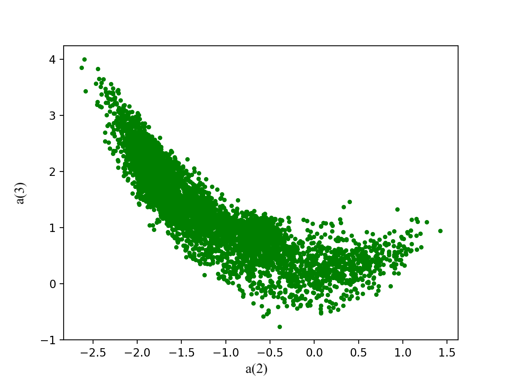


    #### LPCC

    `fmatrix_show work/lpcc/BLOCK01/SES017/*.lpcc | egrep '^\[' | cut -f3,4 > lpcc_2_3.txt`

    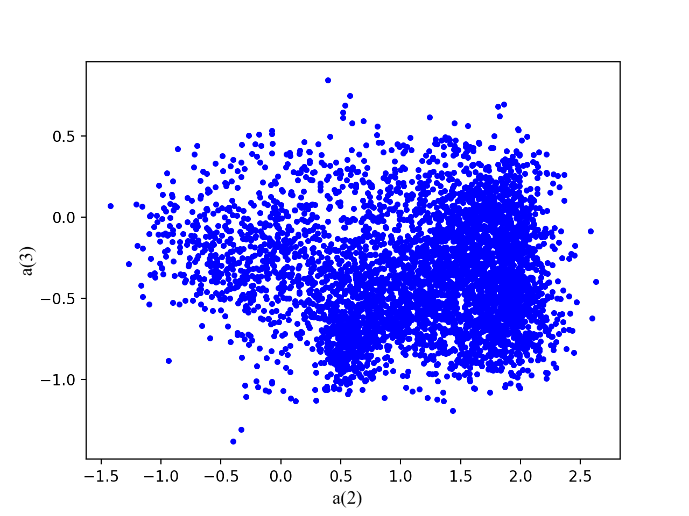


    #### MFCC

    `fmatrix_show work/mfcc/BLOCK01/SES017/*.mfcc | egrep '^\[' | cut -f3,4 > mfcc_2_3.txt`

    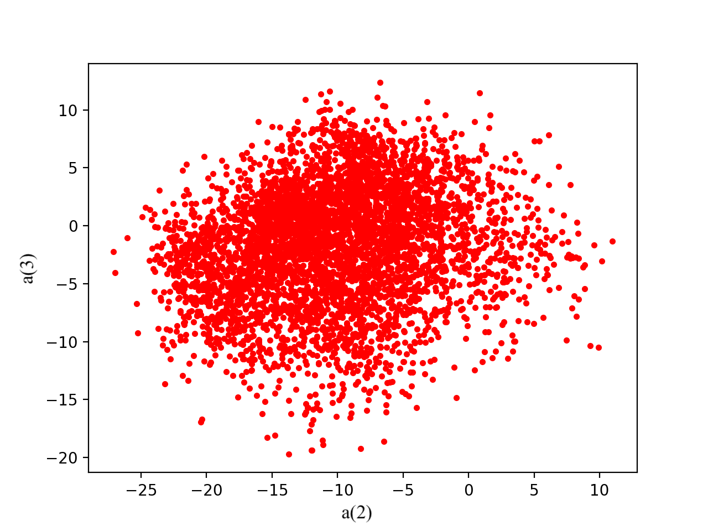


  + **¿Cuál de ellas le parece que contiene más información?**

    En general, mirando las gráficas, vemos que no podemos extraer mucha información.  Aun así, observamos una correlación muy alta entre los dos coeficientes:

    1. Si su función en el plano es una línea, aunque no lineal, monótonamente creciente o decreciente, sabiendo el valor de un coeficiente podemos saber cuánto vale el siguiente. Por lo tanto el segundo coeficiente no aporta ninguna información al primero. 

    1. Si la función es una “nube”, saber el valor de un coeficiente no aporta demasiada información acerca de cuánto vale el siguiente → por eso los dos coeficientes aportan información útil.

    Hecho este apunte teórico, podemos observar cómo LP sigue más una distribución (a) y MFCC y LPCC son (b), siendo MFCC más “nube” que LPCC. Por eso, en términos de quién aporta más información: **LP < LPCC < MFCC**


- **Usando el programa <code>pearson</code>, obtenga los coeficientes de correlación normalizada entre los parámetros 2 y 3 para un locutor, y rellene la tabla siguiente con los valores obtenidos.**

  Mediante los siguientes comandos, obtenemos los ficheros .txt con la información de correlaciones normalizadas.

  `pearson work/lp/BLOCK01/SES017/*.lp > lp_pearson.txt`
  
  `pearson work/lpcc/BLOCK01/SES017/*.lpcc > lpcc_pearson.txt`
  
  `pearson work/mfcc/BLOCK01/SES017/*.mfcc > mfcc_pearson.txt`

  |                        | LP   | LPCC | MFCC |
  |------------------------|:----:|:----:|:----:|
  | &rho;<sub>x</sub>[2,3] |-0.872|0.1484|-0.205|
  
  + **Compare los resultados de <code>pearson</code> con los obtenidos gráficamente.**
  
    Los valores de una correlación normalizada se encuentran en este intervalo [-1,1]. Por tanto, |ρx| tiene valores entre 0 y 1. 

    |                        | LP   | LPCC | MFCC |
    |------------------------|:----:|:----:|:----:|
    | módulo(&rho;<sub>x</sub>[2,3]) |0.872|0.1484|0.205|
  

    Cuanto más cercano a uno sea el valor, más correlación hay. Cuanto más cercano a 0 sea, menos correlación habrá entre los coeficientes. 

    Pearson determina si existe correlación entre los coeficientes y fuerza que sea lineal. Por lo tanto, LP es normal que tenga una correlación cercana a 1, ya que como hemos visto en las gráficas, los valores eran muy correlados. En cambio, con LPCC y MFCC nos damos cuenta de que los valores son mucho más cercanos a 0 que a 1, comprobando así la incorrelación entre sus valores, y la relación con la forma de “nube” de las gráficas anteriores. 

    Aún así, LPCC tendría que ser un valor mayor a MFCC… hemos probado con otro locutor, concretamente BLOCK00/SES001, y el resultado es el siguiente, el cual si que cuadra con la teoría:

    |                        | LP   | LPCC | MFCC |
    |------------------------|:----:|:----:|:----:|
    | módulo(&rho;<sub>x</sub>[2,3]) |0.8059|0.3619|0.0400|
  
      Como vemos, en este caso se cumple lo que hemos explicado anteriormente. 

- **Según la teoría, ¿qué parámetros considera adecuados para el cálculo de los coeficientes LPCC y MFCC?**

  1. Para lpcc se suele utilizar una predicción de orden de 8 a 12 aproximadamente y un número más elevado de coeficientes cepstrales. En nuestro caso, para simplificar hemos cogido una predicción de orden 8, igual que la de lp, y 20 coeficientes cepstrales
  1. Para mfcc el valor habitual para empezar es de 13 coeficientes y el banco de filtros entre 20 y 40. En nuestro caso utilizamos 13 coeficientes y para simplificar usamos un banco de filtros de 20 coeficientes, el mismo valor que en el lpcc.

### Entrenamiento y visualización de los GMM.

**Complete el código necesario para entrenar modelos GMM.**

- **Inserte una gráfica que muestre la función de densidad de probabilidad modelada por el GMM de un locutor para sus dos primeros coeficientes de MFCC.**
  
  Como más gaussianas hay, más se amolda a la población. En estas dos imágenes, aunque no se muestra la población, se comprueba lo dicho:

  **Cinco gausianas:**

  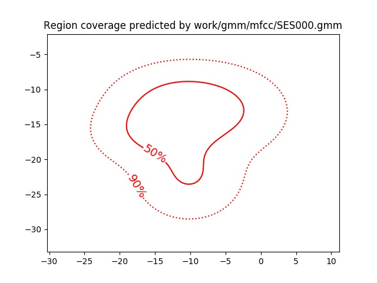

  **Muchas gausianas:**

  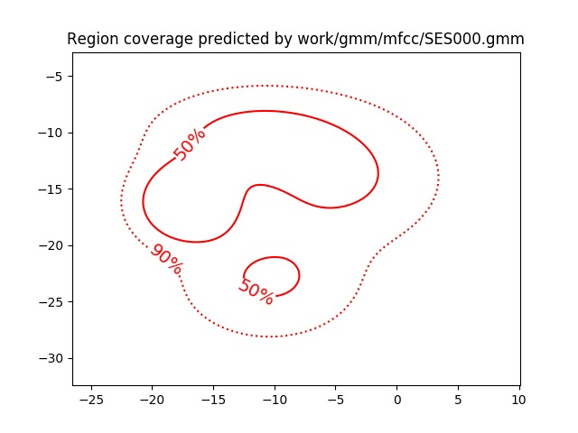

- **Inserte una gráfica que permita comparar los modelos y poblaciones de dos locutores distintos (la gŕafica de la página 20 del enunciado puede servirle de referencia del resultado deseado). Analice la capacidad del modelado GMM para diferenciar las señales de uno y otro.**

  En las 4 imagenes podemos observar la población (puntos) y a su vez, la gráfica de función de densidad de los locutores BLOCK01/SES017 y BLOCK01/SES016. Como vemos, en las dos gráficas que la curba de densidad y la población son del mismo color (representan al mismo locutor), la curba se amolda a la población claramente. En cambio, cuando son de colores distintos, es decir, representan la función de densidad de un locutor con la población de otro, se nota como no cuadra… ya que donde es mas densa la población, no está marcado bien con la función de densidad. 

  El hecho de que podamos ver la diferencia entre ambos, indica que el modelo GMM se ajusta bien a las características del locutor, siendo así una buena forma de reconocer y verificar el locutor.

  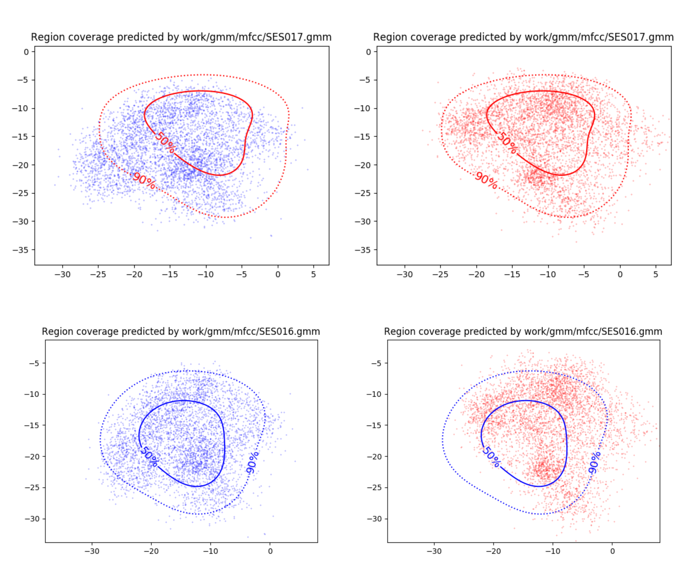

  Comandos:

  `plot_gmm_feat work/gmm/mfcc/SES017.gmm work/mfcc/BLOCK01/SES017/.mfcc -f red -g red`
  
  `plot_gmm_feat work/gmm/mfcc/SES016.gmm work/mfcc/BLOCK01/SES016/.mfcc -f blue -g blue`
  
  `plot_gmm_feat work/gmm/mfcc/SES017.gmm work/mfcc/BLOCK01/SES017/.mfcc -f blue -g red` 
  
  `plot_gmm_feat work/gmm/mfcc/SES016.gmm work/mfcc/BLOCK01/SES016/.mfcc -f red -g blue` 


### Reconocimiento del locutor.

**Complete el código necesario para realizar reconociminto del locutor y optimice sus parámetros.**

- **Inserte una tabla con la tasa de error obtenida en el reconocimiento de los locutores de la base de datos SPEECON usando su mejor sistema de reconocimiento para los parámetros LP, LPCC y MFCC.**


  |                        | LP   | LPCC | MFCC |
  |------------------------|:----:|:----:|:----:|
  | Cost detection |91.2%|77.9%|20.8%|


   Adjuntamos a continuación pantallazos:
   
##### LP

  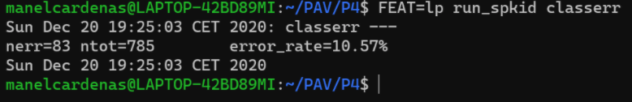

##### LPCC

  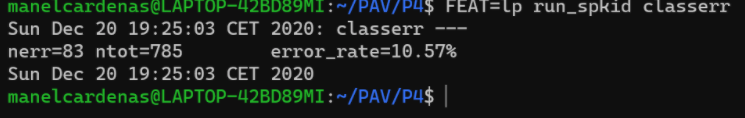

##### MFCC

  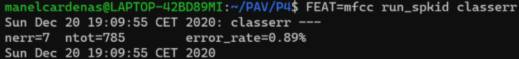

### Verificación del locutor.

**Complete el código necesario para realizar verificación del locutor y optimice sus parámetros.**

- **Inserte una tabla con el *score* obtenido con su mejor sistema de verificación del locutor en la tarea de verificación de SPEECON. La tabla debe incluir el umbral óptimo, el número de falsas alarmas y de pérdidas, y el score obtenido usando la parametrización que mejor resultado le hubiera dado en la tarea de reconocimiento.**

   Nuestro mejor sistema ha sido con MFCC, a continuación está la tabla con los datos que se nos pide:

  |**CostDetection**| 20.8 | 
  |------------------------|:----:|
  |THR|0.673979817092502|
  | Missed |52 / 250 = 0.2080|
  | False Alarm |0 / 1000 = 0.0000|
 
 
  Adjuntamos a continuación pantallazos de todos los sistemas:
  
 ##### LP
 
   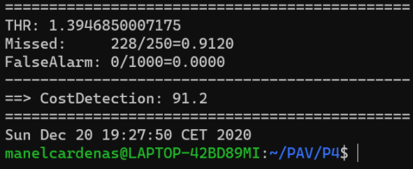

 ##### LPCC

   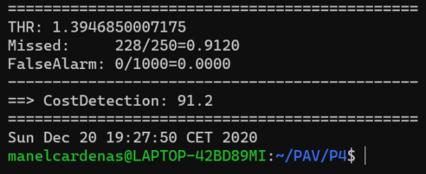

 ##### MFCC
 
   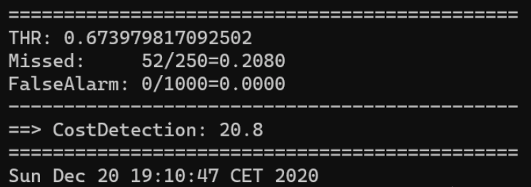

### Test final

- **Adjunte, en el repositorio de la práctica, los ficheros `class_test.log` y `verif_test.log` correspondientes a la evaluación *ciega* final.**

### Trabajo de ampliación.

- **Recuerde enviar a Atenea un fichero en formato zip o tgz con la memoria (en formato PDF) con el trabajo  realizado como ampliación, así como los ficheros `class_ampl.log` y/o `verif_ampl.log`, obtenidos como resultado del mismo.**
